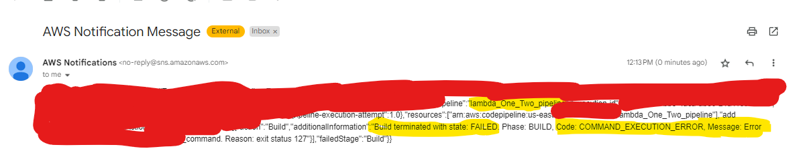

# Configuring AWS SNS to recieve notifications on Pipeline Events

Official Docs : [Click Here](https://docs.aws.amazon.com/codepipeline/latest/userguide/notification-rule-create.html)

Pipeline Events Docs : [Click Here](https://docs.aws.amazon.com/dtconsole/latest/userguide/concepts.html#events-ref-pipeline)

## Steps

- Go to your **AWS Pipelines** -> Choose your Pipeline -> Go to **Pipeline Settings**

- Go to **Notifications Settings Tab** -> Choose `Create Notifcation Rule`

- name the notification name as `pipline-failure` as we are going to get notified only when the pipeline fails. (Choose according to your needs)

- Choose the **Detail Type** as per your need 

- In **Events that trigger notifications** choose Choose `Pipline Execution Failed` Checkbox (Choose according to your needs)

- Click **Create Target** -> Choose **SNS Topic** 

-  Provide a name for the topic after `codestar-notifications-` like `codestar-notifications-lambdaPipefail`,and then choose **Create**.

- Submit It

### Subscribe to Notifications

- Go to **SNS Topics** and Choose the one which you have created.

- Click on **Create subscription** -> Choose the protocol as **"Email"** -> Enter your email address -> Click **Create subscription**.

- Now Check your mail and Confirm your Subscription.

### Testing

- Now Run the Pipeline with some errors to check for the email notification

